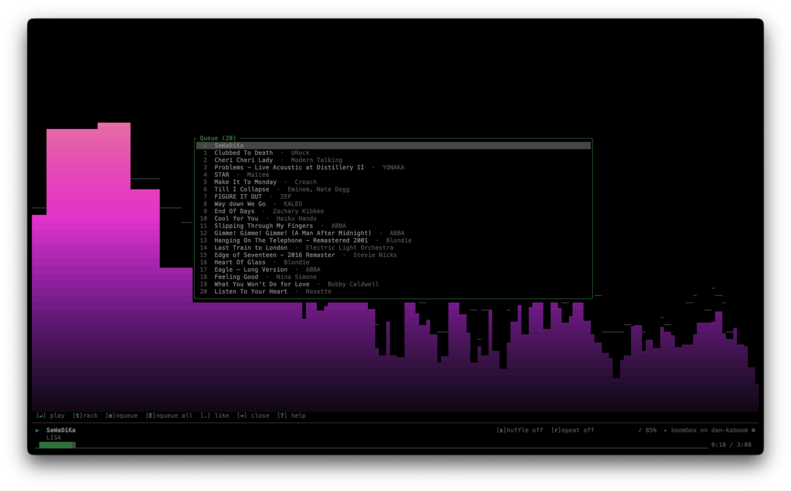
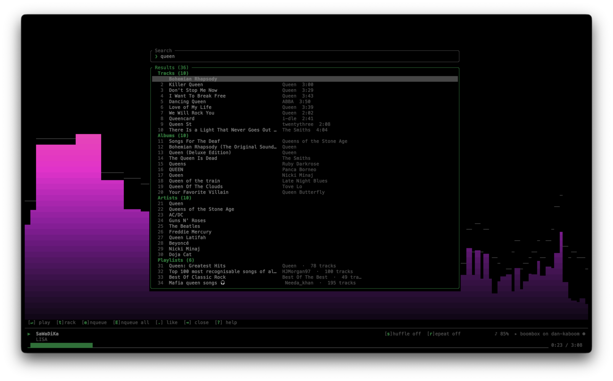
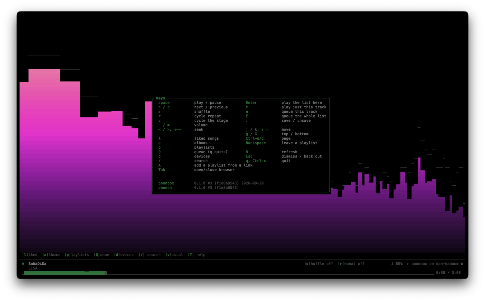
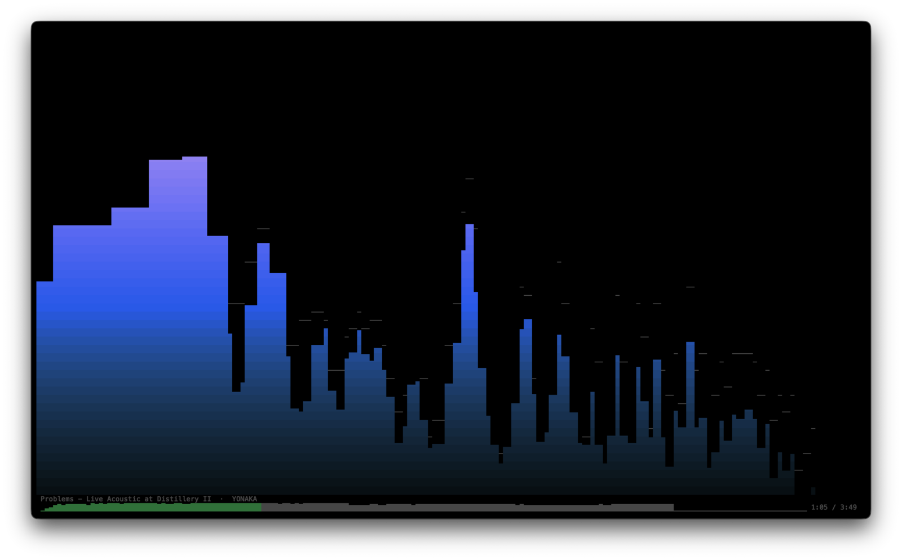
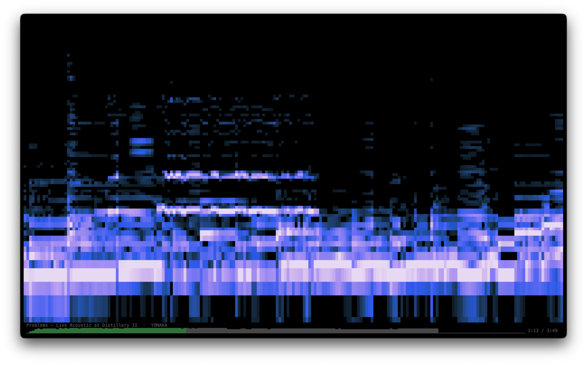
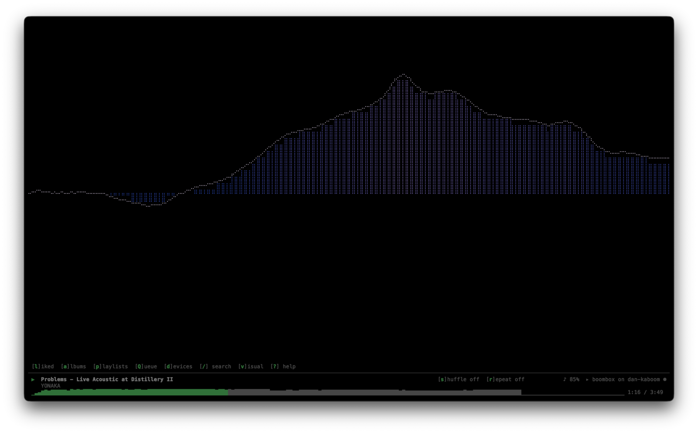

# boombox

A Spotify client for the terminal: a TUI and a scriptable CLI over the same core.

```console
$ boombox next
$ boombox now --json | jq -r .track.name
$ boombox            # opens the TUI
```


boombox is an independent project. It is not affiliated with, endorsed by or
connected to Spotify; Spotify is a trademark of Spotify AB. Track, album,
artist and playlist information, and album artwork, come from Spotify. You
need Spotify Premium, and a Spotify developer app of your own, which
`boombox setup` walks you through.

## Status

Working: authentication, the full playback surface, a caching daemon, the TUI,
and search/playlists/library.

Optional streaming: built with `--features streaming`, the daemon advertises
itself as a Spotify Connect device and plays audio itself. Without it, boombox
drives an existing device — the desktop app, a phone, a speaker.

### What Spotify still allows, as of August 2026

Verified against the live API, not just the changelog:

| | |
|---|---|
| `GET /me/tracks` `/me/albums` `/me/shows` `/me/episodes` | work — only the PUT/DELETE verbs were consolidated |
| `GET /me/playlists`, `GET /playlists/{id}` | work |
| `GET /playlists/{id}/items` | **your own and collaborative playlists only** |
| A Spotify editorial playlist | **404** — not "metadata only", simply gone |
| `GET /me/library` | **405** — the consolidated endpoint is write-only |
| `search?limit=11` | **400 Invalid limit** — the cap is 10 and it does not clamp |
| `GET /me/top/{artists,tracks}` | works, needs the `user-top-read` scope |

Playlist rows are `{added_at, added_by, is_local, item:{…}}` — `track` was
renamed to `item`. `/me/tracks` still nests under `track`; only the playlist
endpoints were renamed.

## Commands

```console
boombox setup                         # first run: your app, signing in, audio
boombox next | previous | pause | play | toggle
boombox play spotify:album:...        # or track / playlist / artist / show URIs
boombox seek 1:45 | 90 | +30 | -10
boombox vol                           # print current
boombox vol 60 | +10 | -5
boombox shuffle [on|off|toggle]       # toggle is the default
boombox repeat [off|track|context]    # omit to cycle
boombox devices [--json]
boombox connect "Kitchen"             # name, prefix, substring or id
boombox queue list [--limit N] [--json]
boombox queue add spotify:track:...
boombox now [--json] [--format TPL]

boombox search QUERY... [--types T] [--limit N] [--offset N] [--json]
boombox playlist list [--json]
boombox playlist show NAME [--limit N] [--json]   # name, id or URI
boombox liked [--limit N] [--json]
boombox albums [--json]
boombox like [URI]                    # what is playing, if omitted
boombox unlike [URI]

boombox auth login | status | logout
boombox config path | init | show
boombox api PATH [--method M]         # a raw Web API request, for debugging

boombox                               # open the TUI (the default)
boombox tui

boombox daemon                        # run in the foreground
boombox daemon --status
boombox daemon --stop
```

Add `--direct` to any command to bypass a running daemon.

`now --format` placeholders: `{title}` `{artist}` `{album}` `{position}`
`{duration}` `{remaining}` `{pct}` `{bar}` `{bar:N}` `{status}` `{state}`
`{device}` `{volume}` `{shuffle}` `{repeat}` `{uri}`. Unknown keys are left
verbatim so typos are visible.

```console
$ boombox now
▶  Move · Example Artist  0:08/2:59

$ boombox now -f '{artist} — {title}'
Example Artist — Move

$ boombox now -f '{position}/{duration} {bar:24} {pct}%'
0:25/2:59 ━━━───────────────────── 14%
```

Confirmation output is written only when stdout is a terminal, so commands
bound to a hotkey stay instant and pipelines stay clean. `--json` output is
always written.

`now --json` carries `"pending"`. It is true while a change has not come back
from Spotify yet, which means the volume, position or play state beside it is
what was asked for rather than what the API has confirmed — a write takes a
poll or two to appear, and about eleven seconds for volume. A status line
reading `"pending": false` is reading the player; `true` is reading intent
that may still be refused.

## You need your own Spotify app

There is no way around this. Spotify's February 2026 Developer Mode changes mean
every user registers their own app:

- the app owner needs an **active Spotify Premium subscription**
- an app in Development Mode works for **up to five accounts**, each added by hand
- Extended Quota Mode is only for organisations with 250,000 monthly active
  users, so it is out of reach

Run `boombox setup`, or just `boombox`: on a first run it offers setup before opening
the player. It opens the dashboard, says exactly what to enter, takes the Client
ID when you paste it, saves it to the config, and signs you in. Anything already
done is skipped, so it is safe to run again.

By hand, the steps are:

1. <https://developer.spotify.com/dashboard> → **Create app**
2. Redirect URI: `http://127.0.0.1:8888/callback`
   — the loopback literal. `localhost` is rejected, and plain HTTP is permitted
   for loopback addresses only.
3. If asked which APIs you will use: **Web API**
4. In the app's settings, **User Management** → add your own Spotify account.
   Without it Spotify will usually let you sign in, then refuse every request
   with 403.
5. Put the Client ID from the app's settings in the config file and run
   `boombox auth login`, or pass it as `boombox auth login --client-id <id>`, which
   saves it for you.

Both `boombox setup` and `boombox auth login` ask Spotify whether the Client ID
belongs to an app before saving it or opening the browser, so a Client Secret
pasted in its place — both are 32 characters — is caught straight away. Setup
offers to replace a saved ID Spotify does not recognise, and
`boombox auth login --client-id <id>` replaces one at any time. The check cannot
see the redirect URI; Spotify only checks that after you sign in.

`SPOTIFY_CLIENT_ID` works too if you would rather keep it in your shell profile.

## Install

boombox runs on **macOS and Linux**. The daemon talks over Unix sockets, so
Windows is not supported.

You need:

- **Rust 1.88 or newer**, from <https://rustup.rs>
- **Spotify Premium**, and a Spotify developer app of your own, which
  `boombox setup` walks you through
- **On Linux, for streaming only:** the ALSA development headers and
  `pkg-config` — `sudo apt install libasound2-dev pkg-config` on Debian and
  Ubuntu, `sudo dnf install alsa-lib-devel pkgconf-pkg-config` on Fedora

```console
git clone https://github.com/danySam/boombox
cd boombox
cargo install --locked --path crates/boombox --features streaming
boombox setup
```

Leave out `--features streaming` if you only want to control Spotify on your
other devices: it builds without ALSA, and without the audio visualisations.

## Layout

```
crates/boombox-core/     auth, API client, config — everything shared
  src/auth/           PKCE, loopback redirect listener, token store
  src/api/            thin reqwest layer over the Web API
    player.rs         the PlayerApi trait — the swappable transport seam
    library.rs        the LibraryApi trait: search, playlists, saved items
crates/boombox-ipc/      the daemon wire protocol; PlayerApi + LibraryApi over it
crates/boombox-tui/      ratatui front end
  src/keymap.rs       key -> Action, a pure function
  src/app.rs          state and update logic, no I/O
  src/ui.rs           rendering
crates/boombox/          the `boombox` binary
  src/fmt.rs          duration/volume parsing, templates, progress bars
  src/player_cmd.rs   playback verbs, generic over PlayerApi
  src/daemon.rs       poller, socket server, cache
```

Library reads go through the daemon too when one is running. Not for speed —
the daemon does not cache them — but so a single process owns the token.
Spotify rotates the refresh token on use, and two processes refreshing
independently will eventually invalidate each other's session.

`PlayerApi` is implemented twice — once by the HTTP client, once by the IPC
client — so `player_cmd` is generic over it and neither knows which it has.
Choosing a backend is two lines in `player_cmd::run`. A librespot-backed
implementation can slot in the same way later.

Tokens go to a `0600` file under `$XDG_STATE_HOME/boombox`, a directory boombox keeps
readable only by you, as it does librespot's streaming login beside it. Every
run re-tightens both, so an older install is fixed the first time a new binary
starts. The keychain is opt-in; see below. Config lives at
`$XDG_CONFIG_HOME/boombox/config.toml` (`~/.config/boombox/config.toml`), on macOS
too — `BOOMBOX_CONFIG_DIR`, `BOOMBOX_STATE_DIR` and `BOOMBOX_CACHE_DIR` override.

## The TUI

`boombox` with no arguments. The player bar along the bottom is always there.
Above it is the stage — what is playing, with its cover, or a visualisation —
and your library opens over the stage as a box that `Tab` or `Esc` closes.


The line above the bar lists the keys for whatever is in front of you, and the
status row names the keys that change it: `[s]huffle`, `[r]epeat`, `[</>] seek`
and `[-/=]` in front of the volume. The last two are keys with no word to hide
a letter in, so they appear as pairs instead. A narrower terminal sheds them —
keys from 110 columns, words from 96, icons below that — because the state
beside them is what the row is for.

Keys move the screen at once and reach Spotify when you stop pressing. Holding
`>` scrubs the bar and sends a single seek at the end, rather than one write
per press each lurching the bar as it lands; two quick taps of `space` cancel
out and send nothing at all.

The dot at its end says whether a daemon is attached (`●`) or the TUI is
talking to the API directly (`○`). That matters: with a daemon it polls four
times a second, without one it polls once a second to stay inside the rate
limit.

| key | |
|---|---|
| `space` | play/pause · `n`/`b` next/previous |
| `<` `>` or `Shift-←→` | seek · `-`/`=` volume |
| `s` `r` | shuffle · cycle repeat |
| `l` `a` `p` `Q` `d` | liked songs · albums · playlists · queue · devices |
| `/` | search — a pasted Spotify link plays instead of searching |
| `Tab` `Esc` | open or close the browser · dismiss whatever is on top |
| `j` `k` `↓` `↑` | move · `g`/`G` top/bottom · `Ctrl-u`/`Ctrl-d` page |
| `Enter` | play from here, or open a playlist · `Backspace` leave it |
| `t` `e` `E` | play just this track · queue it · queue the whole list |
| `.` | save or unsave the selected row |
| `A` | add a playlist from a link, in the playlists view |
| `v` `R` `?` `q` | cycle the visualisation · refresh · help · quit (`Q` is the queue) |

| | |
|---|---|
|  |  |

`?` lists every key, and the build the TUI and the daemon are each running —
the quickest way to spot a daemon left over from an older install.



Lists page as you scroll rather than all at once — Liked Songs pulls 50 rows at
a time and fetches the next page when the cursor nears the bottom. Search is
capped by Spotify at 10 results per type, so the TUI asks for four types at
once instead of paging one type deeply.

The playlists view opens with a **Recently played** section above your own
playlists. Spotify does not tell third-party clients what its own playlists
are — Daily Mixes, Discover Weekly and the radios are absent from
`/me/playlists`, absent from search, and 404 when fetched by id — so the
daemon watches what actually plays and remembers it. Names and cover art
come from `open.spotify.com/oembed`, which is public and does answer for
them; the Web API is asked first, since the two cover different things.

**`A` adds a playlist from a link** — paste one in that view and it is
added to the list for good, and starts playing. That is the only way to reach
a Daily Mix the first time: copy the link from any Spotify client, paste it
once, and it is a row for good. The daemon resolves the name in the same
call, so the row lands complete rather than as a raw id that corrects
itself. Pasting into the search box works too, and does the same thing.

Device and queue data load when you open their view and after anything that
invalidates them — a transfer, a track change — rather than on a timer, so
nothing is fetched while you are not looking at it.

Because the TUI owns the screen it logs to a file rather than stderr:

```console
$ BOOMBOX_LOG=debug boombox
$ tail -f ~/.local/state/boombox/boombox.log
```

## Streaming (optional)

Not compiled in unless you ask for it, and on once it is — but only after the
separate streaming sign-in, which `boombox setup` offers as its last step. The
daemon then registers with Spotify as a device named after `device_name`, which
shows up in the picker on your other clients. **Registering is not taking
over:** nothing moves to it until you pick it, and `[daemon] adopt_playback`,
which would make this machine active when nothing else is playing, is off by
default.

Until that sign-in is done, a daemon built with streaming says so once in its
log and carries on driving your other devices. `boombox daemon --status` says
which of the two is missing.

```console
make build-streaming
boombox setup                      # offers it as the last step
```

`boombox auth login --streaming` does the same on its own. The settings live in
`config.toml`:

```toml
[streaming]
enabled = true
# device_name = "boombox"   # default: boombox on <this machine>
bitrate = 320
```

The device is named after the machine it runs on — `boombox on studio` — so
running boombox on a second computer does not put two identical rows in the
picker. Set `device_name` to override it.

**It is a handoff, not a parallel stream.** Spotify allows one active stream
per account, so once you pick boombox, playback stops wherever it was. boombox appears in `boombox devices` like any other target and sits idle
until you `boombox connect boombox`. Audio comes out of whichever machine runs the
daemon. Premium only.

### Spectrum analyser

Press `v` in the TUI to cycle **bars → spectrogram → oscilloscope**, and once
more to go back to the cover.
A real FFT over the audio librespot is decoding — not a decoration driven by
the progress bar.


| bars | spectrogram | oscilloscope |
|---|---|---|
|  |  |  |

The samples are tapped by wrapping librespot's `Sink`, so nothing in librespot
is patched: the decorator copies each packet on its way to the speakers.
2048-point Hann-windowed transform, 128 log-spaced bands, peak-per-band rather
than mean so transients survive.

**Bars** carry falling peak markers that decay against wall-clock time, so a
resized or stalled terminal does not change how fast they fall. The colours are
taken from the cover art, so each track arrives with its own palette.

**Spectrogram** is a waterfall: the newest moment at the right edge, low
frequencies at the bottom, magnitude as colour. Each column is scaled against
its own loudest band, and the quietest 30% of that is dropped, so each moment
reads as a moving ridge rather than a low end painted solid. Each cell is a
half block with independent foreground and background colours, so it resolves
two frequency bins per row rather than one. Near-silent cells are left
undrawn, so the terminal background shows through and it works on light
themes.

**Oscilloscope** is a braille canvas: 2x4 dots per cell, so an 80x20 pane draws
at an effective 160x80 and the trace reads as a curve. Each sweep starts at a
rising zero crossing, so successive frames line up, and the last few stay
behind as a dimmer afterglow. Its automatic gain comes down quickly when the
music gets loud and recovers slowly when it goes quiet, so gaps are not pumped
up to full height.

### Waveform seek bar

The progress bar in the player bar is drawn from the track's own amplitude —
played portion accented, the rest dim. Spotify will not tell us the shape of a
track in advance, so this is the shape of what has actually been heard: the
daemon samples the audio peak ten times a second and writes it into the bucket
for the current position. Without a streaming daemon there is no audio to
measure and it falls back to a plain progress line.

Everything drawn from audio is scaled in decibels rather than linear
amplitude. The tap sits after librespot's volume stage, whose soft mixer is
logarithmic, so at 50% volume raw peaks are around 0.03 — on a linear scale
they draw as nothing at all.

It only shows something while **boombox itself is the active device** — Spotify
allows one stream per account, so listening on a phone or the desktop app
leaves librespot idle and the display flat. This is inherent, not a bug.

Note that Spotify's own `/audio-features` and `/audio-analysis` endpoints are
403 for post-2024 apps, so beat-synced visuals without decoding the audio
yourself are not possible at all. Owning the decode path is the only route.

### Why streaming needs its own login

This is worth writing down. The Connect protocol begins by
asking `clienttoken.spotify.com` for a client token, and that endpoint only
issues them to Spotify's own first-party client IDs. A Development Mode client
ID is rejected with `400 Bad Request`, so the streaming session cannot use
boombox's Web API credentials at all — not the client ID, and not the token.

`boombox auth login --streaming` therefore runs a second OAuth flow under
Spotify's public "keymaster" client and caches reusable credentials under
`$XDG_STATE_HOME/boombox/librespot`. The daemon uses those; the Web API half
carries on with your own client ID. Two sessions, two lifetimes, by necessity.

## The daemon

Optional, and everything works without it. When one is running, the CLI routes
through it automatically; when it isn't, commands go straight to the API. The
fallback is silent and per-invocation, so you can start and stop the daemon
under a live shell without anything breaking.

It exists because `boombox now` in a status line would otherwise mean an HTTP
round trip every couple of seconds, which the Development Mode rate limit will
not tolerate. Measured on a 10s poll interval:

| | per call | API calls for 20 reads |
|---|---|---|
| via daemon | ~9 ms | 0 |
| `--direct` | ~293 ms | 20 |

The cached progress clock is advanced to the current instant on every read, so
the timer stays smooth between polls rather than ticking in steps. Polling
backs off to `poll_idle_ms` when nothing is playing and doubles up to two
minutes after a rate limit. Writes nudge the poller, so a change you make is
reflected immediately instead of waiting out the interval.

The wire protocol is one JSON object per line over a Unix socket, one request
per connection:

```console
$ printf '{"cmd":"ping"}\n' | nc -U ~/.local/state/boombox/boombox.sock
```

Unix socket paths are capped at 104 bytes on macOS and 108 on Linux. If your
state directory is deeply nested, set a shorter path:

```toml
[daemon]
socket = "/tmp/boombox.sock"
```

## Exit codes

Scripts can branch on these.

| | |
|---|---|
| `0` | success |
| `1` | usage error |
| `2` | not authenticated |
| `3` | API error |
| `4` | no active device |
| `5` | Premium required |

## Keeping tokens in the keychain instead

Tokens go to a file by default. To use the OS keychain:

```toml
[auth]
keyring = true
```

On Linux that is GNOME Keyring or KWallet, which works without fuss on a
desktop; where no secret service is running, as on a server or over SSH, boombox
falls back to the file. `BOOMBOX_NO_KEYRING=1` turns the keychain off for one run,
and can never turn it on. Switching stores needs one `boombox auth login --force`,
since the existing token stays where it was.

On macOS the keychain ties access to the **caller's code signature**. A binary
built from source, by `cargo` or by Homebrew, is ad-hoc signed: its identity is
a hash of its own contents, so every build or upgrade is a program the keychain
has never seen, and it asks again. "Always Allow" only covers the exact binary
you clicked it for. A dialog raised by the background daemon has nobody to
answer it, and blocks every other boombox command while it waits. That is why the
keychain is off by default.

## Development

Building, testing and the optional macOS code-signing setup are covered in
[CONTRIBUTING.md](CONTRIBUTING.md).
